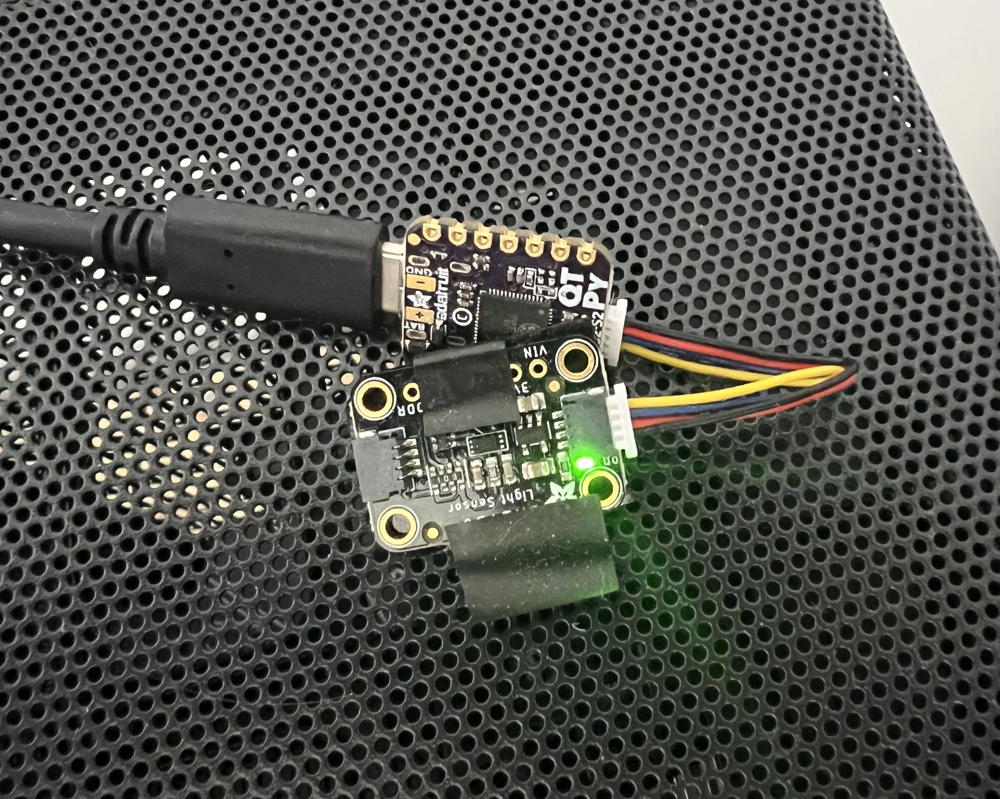
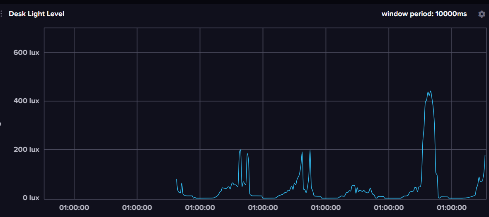
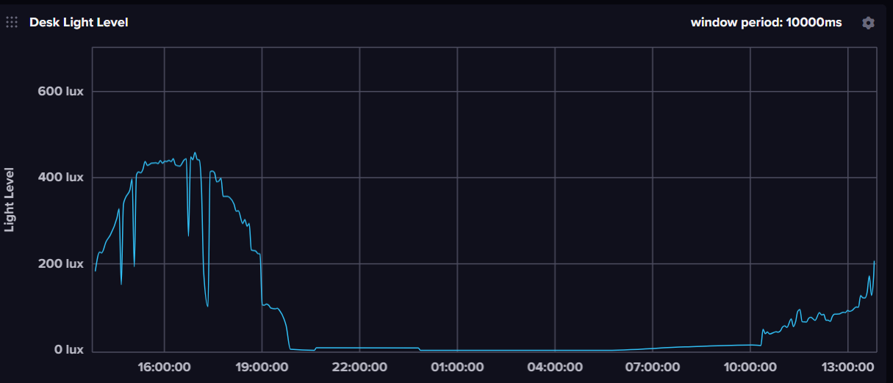

I live in a small flat in the South West of London. It's not a city known for warm weather and in fact this summer (2023) has been very cloudy and dull. 

However, something I quickly noticed after moving in, is that partly cloudy weather is very common. One second it's nice and bright, the next the shine is gone. 

This made it very frustrating to adjust my monitor brightness because I couldn't keep up. It was so frustrating that I would get genuinely angry and just pull the curtains. Even so, the constant variation in light level was still there.

One day as I was sitting there in my chair losing my mind over the partly cloudy weather outside, I finally broke down and bought the components for a light level sensor.

# The Light Sensor

For the microcontroller I bought an [Adafruit QT Py ESP32-S2 WiFi](https://www.adafruit.com/product/5325) which I chose because it has WiFi and the I2C port has a STEMMA QT connector so I didn't have to solder anything. I do have a soldering iron in my drawer, but I'm more of a software guy.

The light sensor I chose is an [Adafruit BH1750](https://www.adafruit.com/product/4681) which is an Ambient Light Sensor that measure the light level in lux and has a range from 0 to ~65K.

And with that, I proudly present my DIY light sensor. Tada!



ESP32 and BH1750 just chilling unenclosed on my PC case

So what it's a little janky. Like I said, I do software, not hardware.

# Architecture

There's several different ways to read the output of the light sensor from the PC that needs it. Could be over Serial via USB, or maybe polling over WiFi via a small HTTP server on the microcontroller.

However, in this case I wanted the sensor to be independent, so I decided to send readings over WiFi to my InfluxDB instance.

This decision paid off nicely as you'll see in the last section of this post. It has also yielded some interesting graphs, where you can see roughly how sunny it was over a given week.



Yesterday was very sunny, and today is on track to be sunny as well.

You can also see when I call it a night and go to bed.



Likewise, you can see the sun starting to rise and the sharp increase at 10:20am is me opening the curtains. That's when I got back from the gym, not when I got up!

# The Firmware

I've always enjoyed writing code for microcontrollers because of the, often quite strict, ROM and RAM limitations.

This time was no exception, even though I ran into a gnarly issue with I2C connection.

The firmware is written in C++ using Arduino. This allowed me to bring in two important libraries. Firstly, [hp_BH1750](https://github.com/Starmbi/hp_BH1750) to read light levels from the sensor. Secondly, [InfluxDbClient](https://github.com/tobiasschuerg/InfluxDB-Client-for-Arduino) to send data points to InfluxDB.

## Secrets

To start with I created a header called `secrets.h`, so I could share the firmware more easily without leaking sensitive credentials.

```cpp
// DB
#define INFLUXDB_URL ""
#define INFLUXDB_TOKEN ""
#define INFLUXDB_ORG ""
#define INFLUXDB_BUCKET ""

// WiFi
#define WIFI_SSID ""
#define WIFI_PASSWORD ""
```

## Setup

In the setup function, we first connect to WiFi:

```cpp
void setup()
{
  // open serial
  Serial.begin(115200);

  // connect to WiFi
  Serial.print("attempting to connect to SSID: ");
  Serial.println(WIFI_SSID);

  WiFi.begin(WIFI_SSID, WIFI_PASSWORD);
  while (WiFi.status() != WL_CONNECTED) {
      delay(500);
      Serial.print(".");
  }

  Serial.println("");
  Serial.println("connected to WiFi");
```

Then configure the pins of Wire1 to read from the STEMMA QT port:

```cpp
	// set Wire1 (second wire) pins so we can connect to the BH1750 sensor
  Wire1.setPins(SDA1, SCL1);

  // init light sensor
  sensor.begin(BH1750_TO_GROUND, &Wire1); // <- needed because sensor is connected to QUIC port
  
  // make first measurement
  sensor.start();

  // add lightSensor tag
  lightSensor.addTag("device", "living-room-1");
}
```

## Loop

The loop function just reads and sends light level data.

```cpp
void loop() {
  // check if sensor value is ready
  if (sensor.hasValue()) {
    // get and print lux
    float lux = sensor.getLux();
    Serial.printf("%f lux\n", lux);

    // save in InfluxDB
    lightSensor.clearFields();
    lightSensor.addField("intensity", lux);

    // print whether write was successful
    if (!dbClient.writePoint(lightSensor)) {
      Serial.print("influxdb write failed: ");
      Serial.println(dbClient.getLastErrorMessage());
    } else {
      Serial.println("added point to database");
    }
    Serial.println("");

    // start reading next point
    sensor.start();
  }
}
```

The resolution of the data is limited by how quickly the light sensor can produce a reading. This is however quite quick and results in about two readings per second.

That level of details is unnecessary for analytical purposes, but significantly reduces latency in monitor brightness response, because the latest light level reading is no older than 500ms. 

# The monitor client

The application responsible for updating the monitor brightness based on the measured light level, is a little more complicated than the firmware.

The naïve, and my initial approach is to simply map light level to monitor brightness with a linear equation that feels good. 

The equation I came up with is as follows:

<math>
  <mi>brightness</mi>
  <mo>=</mo>
  <mfrac>
    <mi>lux</mi>
    <mn>5</mn>
  </mfrac>
  <mo>+</mo>
  <mn>5</mn>
</math>

It feels good, but applying it without any other rules lead to jitter. If it's unquestionably sunny, the light level will fluctuate resulting in 65% then 66% then 65%. grrrr.

To solve that issue, and others, I decided to create two threads sharing one variable `brightnessGoal`.

## Thread 1: Brightness calculations

This thread reads the latest light level from InfluxDB, converts the lux value to a monitor brightness percentage value, and then makes a decision on whether to update the brightness goal.

The rules are as follows:

- If the brightness has **increased** by more than 5%, update goal
- If the brightness has **decreased** by more than 3%, update goal
- If has been more than 15 seconds since last brightness change, anything goes

```go
brightness := LuxToBrightness(currentLightLevel)

// if the brightness has changed by more than 5%, set the brightness to the new value
if brightness != currentBrightness && (brightness-currentBrightness <= -3 || brightness-currentBrightness >= 5) {
	QueueBrightnessChange(brightness)
} else if brightnessGoal == 0 {
	QueueBrightnessChange(brightness)
}

// if the brightness has not changed for 15 seconds, set the brightness to the new value
if time.Since(lastBrightnessChange) > time.Second*15 && currentBrightness != brightness {
	fmt.Println("brightness change wanted for >15 seconds")
	QueueBrightnessChange(brightness)
}

time.Sleep(time.Millisecond * 500)
```

## Thread 2: Brightness Orchestrator

This thread is in charge of setting all the brightness values of the connected monitors to the desired goal.

It is important to *smoothly* increase and decrease the brightness. To achieve this, I created a `for` loop (Go equivalent for `while`) that does the following:

- First check if `currentBrightness` is different than `brightnessGoal`
- If it is, **decrement/increment** in the desired direction
- Sleep 5ms
- Go again

Critically, this allows the thread to not commit to a goal. If the goal is changed before it's reached, that's fine! 

```go
for {
		if currentBrightness != brightnessGoal {
			delta := 0

			if math.Signbit(float64(brightnessGoal - currentBrightness)) {
				currentBrightness--
				delta = -1
			} else {
				currentBrightness++
				delta = 1
			}

			SetMonitorBrightness(compositeMonitors, delta, currentBrightness-delta)

			fmt.Printf("Setting brightness to %d%%\n", currentBrightness)
			brightnessItem.SetTitle(fmt.Sprintf("Brightness: %d%%", currentBrightness))
		}

		time.Sleep(time.Millisecond * 5)
}
```

The non-committing design ensures the monitor brightness is as close as possible to “correct” value when there is a high frequency in light level change. Like I said, it can fluctuate wildly and quickly on partly cloudy days.

# Source Code

I have shared only snippets of both the firmware and client, but the full source code is available [here on Github](https://github.com/simse/monitor-brightness).

It's obviously not release level quality, and it still needs documentation, but maybe it can still be useful.